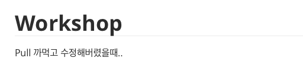
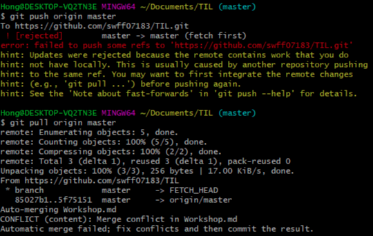
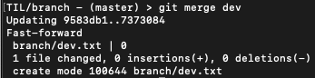
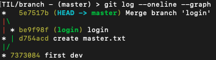

# GitHub

## 회원가입

### 설정변경

- main 브랜치를 master 브랜치로 기본값 수정


## 원격 저장소와 로컬 저장소 연결

### Repository 생성

- git remote
- git push


## gitignore

[gitignore.io](https://gitignore.io)

- 원격 저장소에도 파일이 있고, 로컬에도 이미 있고, 이미 트래킹중인 파일을 로컬에서만 더이상 추적하지 않도록 설정 -> 잘 안씀..

```bash
$ git update-index --assume-unchanged{file name}
```

- 로컬에 있는 파일 변동 추적 멈춤
- 원격 저장소에 해당 파일이 이미 있따면 그 파일 삭제 (원격 저장소에 push 할 때 해당 파일 삭제)

```bash
$ git rm --cached {file name}
```

- 로컬, 원격 저장소 모두 파일 삭제후 추적 중지

```bash
$ git rm {file name}
```


## git clone, git pull

- git clone : 원격 저장소 repository 가져오기

```bash
$ git clone https://github.com/{userID}/{repository.git}
```

- git pull : 원격 저장소에 저장된 최신 버전을 로컬에 업데이트 하기

```bash
$ git pull
```


## conflict

pull 하지 않고 같은 파일 같은 라인을 수정했을때

- `Mac` + `데스크탑(Window)`


- Mac에서 `Workshop.md` 파일 수정


- 데스크탑에서 `Pull` 하지 않고 `Workshop.md` 파일 수정



- 데스크탑에서 `commit` 후  `Push` 시도 -> Conflict



- 해당 파일 확인


- 충돌난 파일 수정 후 `commit`


## Branch

[https://gmlwjd9405.github.io/2018/05/11/types-of-git-branch.html](https://gmlwjd9405.github.io/2018/05/11/types-of-git-branch.html)


### git branch 명령어

- 브랜치 `생성` , `삭제` , `조회` 명령어

```bash
# 브랜치 조회
$ git branch

# 원격 저장소의 브랜치 목록 확인
$ git branch -r

# 브랜치 생성
$ git branch {branch name}

# 브랜치 삭제
# 병합된 수정내용을 합치고 난 후에 삭제 가능
git branch -d {branch name}

# 병합되지 않은 브랜치 강제 삭제
git branch -D {branch name}

```


#### git switch

- 현재 브랜치에서 다른 브랜치로 `HEAD` 를 이동시키는 명령어
- `HEAD` 는 현재 브랜치를 가리키는 포인터

```bash
# 다른 브랜치로 이동
$ git switch {다른 브랜치 이름}

# 브랜치를 새로 생성하고 동시에 이동
$ git switch -c {다른 브랜치 이름}

```

- 주의사항

  git switch 하기 전에 이전 branch에서 한 작업 **commit**


### git merge

[fast-forward, merge commit](https://psklog.tistory.com/22)

```bash
# git merge
$ git merge {합칠 branch}
```




``` bash
# 로그 그래프 형태로 확인
$ git log --oneline --graph
```



