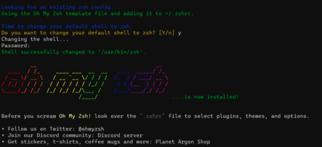

## oh-my-zsh 설치

```bash
# zsh 설치
$ brew install zsh

# 설치경로 확인
$ which zsh
#=> /usr/bin/zsh

# 기본 sh 변경
$ chsh -s $(which zsh)
```


```bash
# oh-my-zsh 설치
$ sh -c "$(curl -fsSL https://raw.githubusercontent.com/robbyrussell/oh-my-zsh/master/tools/install.sh)"
```



## Theme 변경

[oh-my-zsh Theme](https://github.com/ohmyzsh/ohmyzsh/wiki/Themes)

`/.zshrc` 파일 `ZSH_THEME` 값 수정

```tex
ZSH_THEME="{theme_name}"
```

