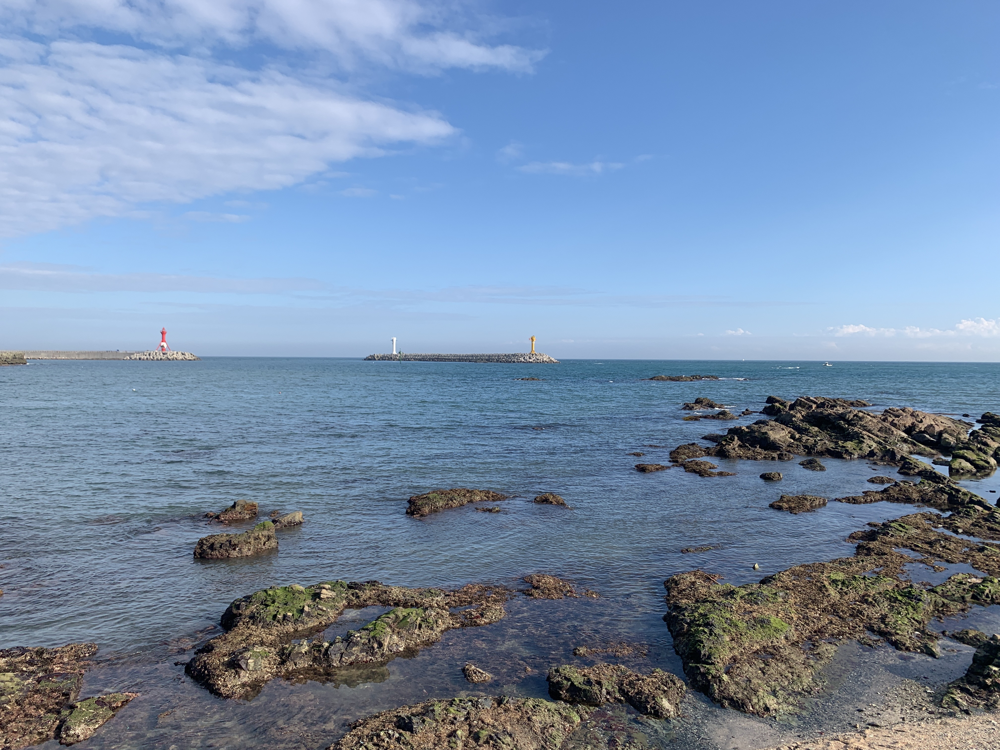

# Markdown
**마크다운 공부하자**

***

## 제목

`#` 개수에 따라서 다양한 크기의 제목 가능(1개 ~ 6개)
```
# 한개
## 두개
### 세개
#### 네개
##### 다섯개
###### 여섯개
```

# 한개
## 두개
### 세개
#### 네개
##### 다섯개
###### 여섯개


## 리스트
### 순서가 없는 목록

- `*` 또는 `-` 
- `tab`키로 들여쓰기
- `shift` + `tab`으로 들여쓰기 취소

```
* 안녕 나는
    * 리스트야
        * 어떠니
```

* 안녕 나는
    * 리스트야
        * 어떠니
        


## 강조

1. **굵게**
   1. `드래그` + `ctrl` + `b`
   2. `**내용**`
   3. `__내용__`
2. _기울임_
   1. `드래그` + `ctrl` + `i`
   2. `_내용_`
   3. `*내용*`
3. ~~취소선~~
   1. `~~내용~~`


## 코드 블럭

1. 인라인 코드(한줄 코드) : 백틱(`)으로 감싸기

   - \` `inline code`\`

2. 블럭 코드(여러줄 코드) : 백틱 세번(```) 입력하고 코드 종류

   - ````
     ```python
     print("hello")
     
     for i in range(10) :
     	print(i)
     ```
     ````

   - ```python
     print("hello")
     
     for i in range(10) :
       print(i)
     ```

   - ```html
     <h1>
       심지어 자동완성도 해줌...
     </h1>
     ```


## 링크

- `[표시할 글자](주소)`

```[]
[Google 홈페이지](https://google.co.kr)
```

[Google 홈페이지](https://google.co.kr)

- Typora에서 링크로 이동하고자 한다면 `Win` : `ctrl` + `click` , `Mac` : `cmd` + `click`


~~끝입니당~~


## 이미지

- ``

- `대체 텍스트` 란, 이미지가 정상적으로 불러와지지 않았을 때 표시되는 문구.
- typora에선 드래그 앤 드랍으로 업로드 가능.




- 사진 크기 조절을 원할때는 `` 태그 사용

```
</img><br/>
</img>
```

</img>


## 표

- `|` -> 파이프 라인

```
|title1|title2|title3|
```

- `win` : `ctrl` + `t`
- `Mac` : `option` + `command` + `t`
- 행을 늘릴 때는(`ctrl` + `enter`)


## 구분선

- `---`

---


## Typora 보기 변경

- `win` : `ctrl` + `/`
- `mac` : `cmd` + `/`

