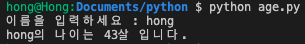

# requests 모듈 사용하여 api 


```python
# https://api.agify.io/?name=hong

# requests 불러오기
import requests

# 나이 예측 api 사용
# 특정 이름을 입력 했을 때, 무작위 나이를 가져와서
name = input("이름을 입력하세요 : ")
url = f"https://api.agify.io/?name={name}"
response = requests.get(url).json()

# ~~의 나이는 ~~살 입니다. 라는 문자 출력
print(f"{name}의 나이는 {response['age']}살 입니다.")
```




### ~~?~~

