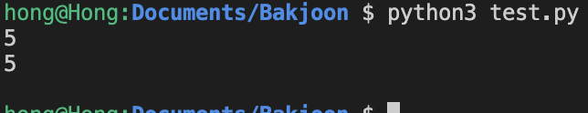
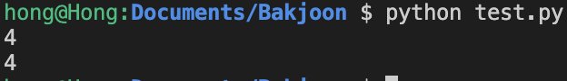
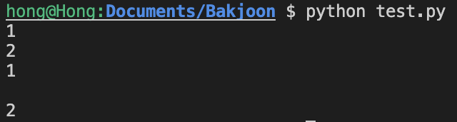

# 입력 받기

### sys.stdin.readline 사용

파이썬에서 보통 입력을 받을때는 Input함수를 사용하였는데, `sys` 모듈을 import 한 후 `sys.stdin.readline()` 함수를 사용하면 빠르게 입력 받을 수 있다. - [백준 15552번 문제 참고](https://www.acmicpc.net/problem/15552)


```python
import sys

# n = input()
n = sys.stdin.readline()
print(n)
```



`sys.stdin.readline()` 함수 사용 시 개행문자를 같이 입력받기 때문에, 개행문자를 제외하고 입력을 받기 위해서는 뒤에 `.rstrip()` 을 추가해주면 된다.

```python
import sys

n = sys.stdin.readline().rstrip()
print(n)
```




입력을 여러번 받게 될 때 `sys.stdin.readline()` 이 조금 길 수도 있어서 변수에 함수 정보를 저장하여 사용할 수도 있다.

```python
import sys

sysInput = sys.stdin.readline
a = sysInput()
b = sysInput().rstrip()

print(a)
print(b)
```

